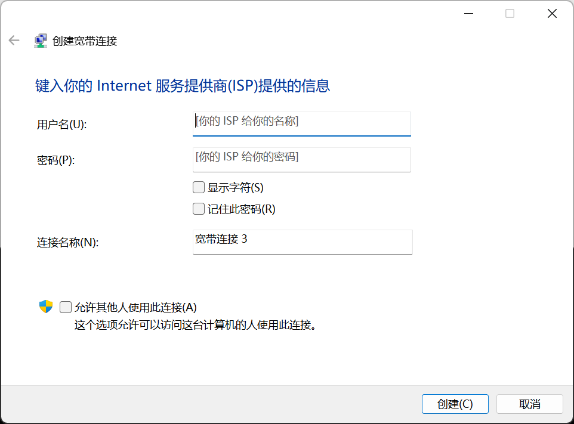
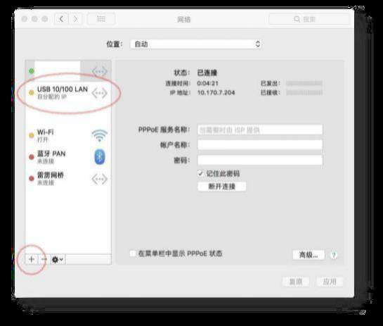
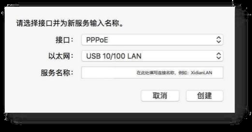
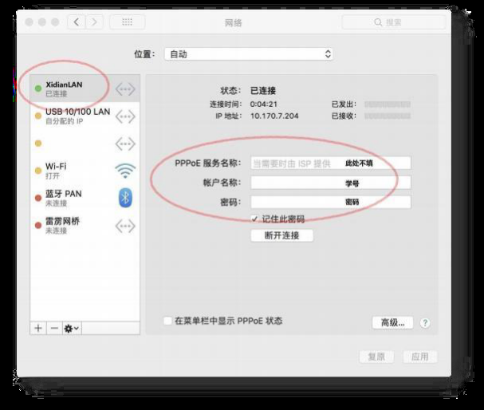

# PPPoE 有线 拨号

该内容引自网络答疑qq群 《网络使用指南_v1.0》.pdf

## Windows10/11用户：

系统设置搜索“宽带”并点击“设置宽带连接”

使用学号为账号（即用户名），身份证后六位为默认密码登录即可使用。
密码修改过的，使用修改后的密码登录；

## macOS用户：

Mac新款机型都不再支持水晶头直接连接，如果要使用网线，则必须搭配RJ-45转USB-C转换器(网线转USB转换器)。

打开系统偏好设置，打开网络设置

正常情况下，应该能够看到转换器设备的名称，例如在图上，转换器显示为USB10/100LAN，然后点击右下角的加号，准备在下一步新建连接；

接口选择PPPoE，以太网选择上一步显示的转换器名称，服务名称可以任意填写，例如：XidianLAN；

点击刚刚新建好的连接(例如刚才新建的XidianLAN)，然后在账号栏输入学号，在密码栏输入密码，PPPoE服务名称保留空白，不要填写。确认无误后点击连接，当有提示是否使用更改时，点是(或确认)。